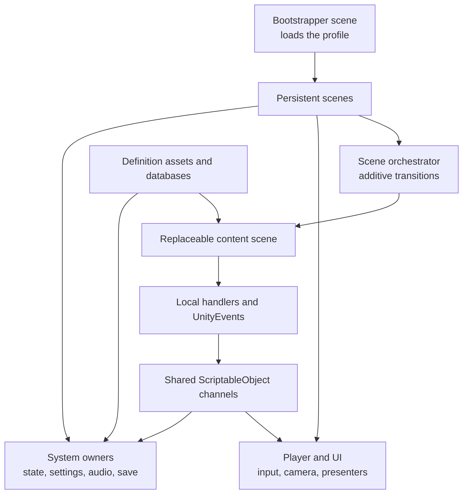

# Making a Game with the Quiet Static Toolkit

This is the end-to-end reference for building a Unity game with the Quiet Static
Toolkit. It explains how the package fits together, how to compose its components in
scenes and prefabs, where its integration boundaries are, and how to diagnose the
failures that most often look like "nothing happened."

The final section uses **Stolen** as a concrete case study. It describes the project's
current scene architecture and GameObjects, explains why they are arranged that way,
and separates working setup from content that is prepared but not yet connected.

This guide was verified against the toolkit and Stolen workspace on **August 17,
2026**. The package is still evolving. When this guide and an Inspector tooltip
disagree, inspect the current component source and serialized configuration first; a
few older setup documents describe intended behavior that is not present in the current
runtime.

## Contents

1. [How to use this guide](#1-how-to-use-this-guide)
2. [Vocabulary](#2-vocabulary)
3. [The architectural model](#3-the-architectural-model)
4. [Install the package and prepare the project](#4-install-the-package-and-prepare-the-project)
5. [Build a first playable slice](#5-build-a-first-playable-slice)
6. [Databases, definitions, flags, and runtime state](#6-databases-definitions-flags-and-runtime-state)
7. [Bootstrap and persistent scenes](#7-bootstrap-and-persistent-scenes)
8. [Input, player movement, and cameras](#8-input-player-movement-and-cameras)
9. [Interactions and player activities](#9-interactions-and-player-activities)
10. [Dialogue and choices](#10-dialogue-and-choices)
11. [Objectives, story sequences, and deductions](#11-objectives-story-sequences-and-deductions)
12. [Readables](#12-readables)
13. [Scene flow and spawning](#13-scene-flow-and-spawning)
14. [Cinematics, camera shots, fades, and credits](#14-cinematics-camera-shots-fades-and-credits)
15. [NPCs and NavMesh behavior](#15-npcs-and-navmesh-behavior)
16. [Audio](#16-audio)
17. [Input-sequence minigames](#17-input-sequence-minigames)
18. [Saving, loading, and checkpoints](#18-saving-loading-and-checkpoints)
19. [Horror tension and jumpscares](#19-horror-tension-and-jumpscares)
20. [UI, settings, pause, and accessibility](#20-ui-settings-pause-and-accessibility)
21. [Environment, utility, and debug tools](#21-environment-utility-and-debug-tools)
22. [Reusable communication patterns](#22-reusable-communication-patterns)
23. [Troubleshooting by symptom](#23-troubleshooting-by-symptom)
24. [Production checklist](#24-production-checklist)
25. [Further reference](#25-further-reference)
26. [Stolen: specific scene architecture and GameObject walkthrough](#26-stolen-specific-scene-architecture-and-gameobject-walkthrough)

## 1. How to use this guide

If this is a new project, work through sections 3 through 10 in order. That produces a
small but structurally correct game: it boots through persistent scenes, lets the
player move and interact, and can run dialogue and objectives. Add later systems only
after that slice works.

If a feature is already present but broken, start at [Troubleshooting by
symptom](#23-troubleshooting-by-symptom), then return to the relevant feature section.
Most toolkit failures are missing references, scene load order, duplicate singleton
managers, mismatched IDs, or input that has been blocked and never released.

Throughout the guide:

- `Packages/com.quietstatic.core/...` means an asset inside the installed package.
- `Assets/MyGame/...` means a project-owned asset. Use your own project folder in place
  of `MyGame`.
- A **current** Stolen example is wired in the project now.
- A **prepared** Stolen example has definitions or prefabs but is not connected to a
  playable content trigger yet.
- A **planned** Stolen example comes from the scene outline or intended story flow and
  should not be mistaken for current runtime behavior.

Do not edit package prefabs in place. Create a prefab variant or duplicate instructional
content into `Assets`. This keeps art, Input Actions, scene references, and project
policy in the game, while reusable behavior remains in the package.

## 2. Vocabulary

Unity and the toolkit use several terms that can sound more complicated than they are.

| Term | Meaning in this guide |
| --- | --- |
| GameObject | An item in a Unity scene hierarchy. It is primarily a container for components and child GameObjects. |
| Component | A script or built-in Unity behavior attached to a GameObject, such as `BoxCollider`, `AudioSource`, or `Interactable`. |
| Inspector | Unity's panel for editing a selected GameObject or asset and assigning serialized fields. |
| Scene | A saved Unity hierarchy. Toolkit projects usually split persistent systems, persistent player/UI, and replaceable content into different scenes. |
| Additive loading | Loading another scene without first destroying the scenes already loaded. This is what lets the player and managers survive a content transition. |
| Prefab | A reusable saved GameObject hierarchy. A prefab variant inherits a base prefab while preserving project-specific overrides. |
| ScriptableObject | A project asset that stores reusable data or acts as a shared event channel. It is not a scene GameObject. |
| Definition | A ScriptableObject that describes authored content, such as an objective, readable, cinematic, or tension profile. Definitions should not hold transient play-session state. |
| Database | A ScriptableObject collection of definitions or IDs. Databases provide stable authoring choices and Inspector dropdowns. |
| Manager | The single runtime owner of a shared concern, such as flags, dialogue, scene flow, or saving. Managers normally live in persistent scenes. |
| Handler | A small scene-facing facade with UnityEvent-callable methods. A content object can reference a nearby handler instead of locating a manager itself. |
| Channel | A ScriptableObject event bus used to send a command across scene boundaries without a direct GameObject reference. Toolkit command channels are synchronous; they do not queue messages. |
| UnityEvent | A configurable event shown in the Inspector. It lets designers connect one component's event to another component's public method. |
| Flag | A stable string ID representing a durable story fact, for example `readable.house.read-letter`. A flag is either set or unset. |
| Requirement | A rule that tests flags, such as "all of these flags must be set" or "none of these flags may be set." |
| Game state | A broad application state such as `Playing`, `Dialogue`, `Paused`, or `Cutscene`. It is different from a story flag. |
| Scene mode | Whether the active content expects gameplay or cutscene presentation. A `SceneModeDefinition` lets the persistent mode manager apply the matching game state and camera policy. |
| Input block | A reference-counted claim that temporarily disables an input group, such as gameplay movement. Releasing every claim re-enables that group. |
| Spawn target | A persistent object that may be placed, usually the player. A spawn point is a content-scene Transform identified by a stable arrival ID. |
| Save participant | A component that implements `ISaveParticipant` so the `SaveManager` can serialize and restore its custom runtime state. |
| NavMesh | Unity's baked navigation surface used by NPC agents to find traversable paths. |

## 3. The architectural model

The toolkit is a set of focused components, not a monolithic game framework. A project
can use only the systems it needs, but the systems work best when ownership is clear.



The important boundaries are:

1. **Managers own runtime state.** There should normally be one active `FlagManager`,
   `DialogueManager`, `SpawnManager`, and so on.
2. **Definitions own authored data.** A `DialogueTree` or `ObjectiveDefinition` can be
   reused and inspected without being a live manager.
3. **Content scenes own local presentation.** Doors, NPCs, triggers, shot cameras, and
   environmental audio belong next to the environment they affect.
4. **Handlers and channels cross boundaries.** A door's `UnityEvent` can call a local
   `FlagHandler`; a transition can raise a request channel heard by the persistent
   `SceneFlowManager`.
5. **Stable IDs cross scenes and saves.** A scene name, flag ID, objective ID, beat ID,
   participant ID, and spawn ID should be treated like a public API once content or a
   save file uses it.

This separation prevents a content scene from retaining a direct reference to a
manager that might not exist when the scene is opened alone, or to an object that is
destroyed during additive replacement.

The package's high-level overview is in the [toolkit
README](../README.md), and the focused module index is in the
[runtime README](../Runtime/README.md).

## 4. Install the package and prepare the project

### 4.1 Choose one package source

For a standalone project, install the package from its Git URL through **Window >
Package Management > Package Manager > + > Install package from git URL**. For the
Quiet Static workspace, use the local dependency already shown by Stolen:

```json
"com.quietstatic.core": "file:../../../libraries/library"
```

Never also copy the same library under `Assets`. Unity would compile duplicate types
and import duplicate GUIDs.

The current package targets Unity 6 and declares the Input System, UGUI/TextMeshPro,
URP, and built-in AI/animation/audio/physics modules. Stolen separately installs the AI
Navigation package for `NavMeshSurface`. Confirm the project's render pipeline, Input
System, and any project-level navigation package are enabled before debugging those
components.

### 4.2 Import samples as references, not production scenes

In Package Manager, select the package and import **Toolkit Examples**. The samples
cover bootstrap, managers and menus, scene orchestration, narrative/horror,
interactions/objectives, and prefab composition. Copy or variant anything you intend
to customize into `Assets/MyGame`.

Samples deliberately leave some project-owned references empty. An Input Action asset,
AudioMixer, art, project scene names, and build configuration cannot be safely chosen
by a generic package. Some package samples and prefabs also contain stale or
project-specific references; use them as annotated scaffolding and validate every
Inspector field.

See the [sample
README](../Samples/README.md) and [common
component recipes](../docs/Runtime/CommonComponentRecipes.md).

### 4.3 Use a predictable project layout

One workable layout is:

```text
Assets/MyGame/
|-- Data/
|   |-- Configuration/       databases, bootstrap profiles, channels
|   |-- Dialogue/            DialogueTree assets and source JSON
|   |-- Objectives/          ObjectiveDefinition assets
|   |-- Cinematics/          CinematicDefinition assets
|   `-- Readables/           ReadableContentDefinition assets
|-- Prefabs/
|   |-- Player/
|   |-- UI/
|   |-- System/
|   `-- Interactions/
|-- Scenes/
|   |-- System/              Bootstrapper, System, Player, UI/orchestrator
|   `-- Content/             House, Office, Station, etc.
|-- Scripts/
|   |-- Runtime/
|   `-- Editor/
`-- Art, Audio, Animations, Materials, ...
```

Keep library source under `Packages`, game-specific scripts and assets under the
project's root folder, and third-party assets in their own folders. This makes it
possible to update the library without mixing package changes with game content.

### 4.4 Prepare Unity project settings

- Add every bootstrap, persistent, content, cinematic, and menu scene used at runtime
  to **File > Build Profiles > Scene List** (called Build Settings in older Unity
  versions). `SceneManager` cannot load a scene that is absent.
- Set **Active Input Handling** to the Input System configuration used by the project.
- Create or choose a project `InputActionAsset`. Do not assume the package player
  prefab's serialized Input Actions reference is valid in another project.
- Import TMP essentials when prompted and assign a project font to UI variants.
- Configure layers before setting an `Interactor` layer mask. A mask stores layer
  numbers, not names; renaming or reordering project layers can invalidate assumptions.
- Create an AudioMixer if using manager-driven volume settings, and expose parameter
  names exactly as described in section 20.

## 5. Build a first playable slice

Build one small content room before authoring the whole game. A good minimum is a room
with a player spawn, an interactable note, one dialogue, one objective, and a door to a
second room.

### 5.1 Create these assets

```text
Data/Configuration/
|-- MainBootstrapProfile.asset
|-- SceneFlowMap.asset
|-- SceneFlowRequestChannel.asset
|-- Flags.asset
|-- GameStates.asset
|-- Objectives.asset
`-- InteractionUIChannel.asset

Data/Dialogue/
`-- TestConversation.asset

Data/Objectives/
`-- ReadTheNote.asset

Data/Readables/
`-- TestNote.asset
```

### 5.2 Create these scenes

```text
Bootstrapper
`-- Scene Bootstrapper
    `-- SceneBootstrapper -> MainBootstrapProfile

System
|-- State
|   |-- GameStateManager                  IDs offered by discovered GameStates asset
|   `-- SceneModeManager
|-- Audio
|   |-- MusicManager
|   `-- SfxManager
`-- EventSystem
    `-- InputSystemUIInputModule

SceneOrchestrator
`-- Scene Flow Manager
    `-- SceneFlowManager -> SceneFlowMap + request channel

Player
|-- Player Root
|   |-- PlayerInput
|   |-- PlayerInputReader
|   |-- CharacterMotor
|   |-- PlayerController
|   |-- SpawnTarget (target ID "Player")
|   `-- Interaction Origin
|       `-- Interactor -> camera + InteractionUIManager
|-- Player Camera
|   |-- Camera
|   |-- AudioListener
|   |-- CameraController
|   `-- SceneModeCameraHandler (Play)
|-- Runtime Managers
|   |-- FlagManager -> Flags
|   |-- ObjectiveManager -> Objectives
|   |-- PlayerManager -> project registration of the active player
|   |-- SpawnManager
|   |-- DialogueManager -> DialogueRunner + DialogueUIManager
|   `-- InteractionUIManager
`-- UI Canvas
    |-- Interaction Prompt
    |-- Dialogue Panel
    |-- Objective HUD
    `-- Readable Overlay

Room01
|-- Scene Mode - Play
|   `-- SceneModeDefinition (Play, state "Playing")
|-- Environment
|-- Spawn Points
|   `-- Entry -> SpawnPoint (ID "room01.entry")
|-- Note
|   |-- MeshRenderer
|   |-- BoxCollider
|   |-- Interactable
|   `-- ReadableInteractionTrigger -> TestNote
`-- Exit Door
    |-- BoxCollider
    |-- Interactable
    `-- SceneTransitionHandler -> "room01.exit"
```

This hierarchy is illustrative. Managers may live in `System`, `Player`, or a separate
UI scene as long as their ownership is single and their load order is deterministic.
Stolen keeps gameplay-facing managers and UI with the persistent player while global
settings, pause, save, state, and audio live in `System`.

### 5.3 Configure the bootstrap profile

Set persistent scenes to `System`, `SceneOrchestrator`, and `Player`; set the initial
content scene to `Room01`; and choose whether other loaded scenes should be unloaded.
Put `Bootstrapper` first in the build scene list and run the game from that scene.

### 5.4 Wire one interaction end to end

1. Add a non-trigger collider to the note and put it on a layer included by the
   player's `Interactor` mask.
2. Add `Interactable`; set prompt text to `Read note`.
3. Add `ReadableInteractionTrigger` to the same GameObject as the exact
   `Interactable`; assign `TestNote` and the shared `InteractionUIChannel`/overlay
   configuration.
4. Confirm `PlayerInput` invokes the `Interactor` on the Interact action, or wire an
   equivalent project input bridge.
5. Confirm a persistent listener exists before `Room01` sends a UI/channel request.
6. Enter Play mode from `Bootstrapper`, aim at the collider, and verify focus text,
   highlight, interaction, overlay close, and input restoration in that order.

Do not add the second room until this path works. It isolates input, raycasting, UI,
channel, and scene-load failures from each other.

### 5.5 Know what the supplied prefabs do not configure

Package prefabs are useful component checklists, but a clean consumer must complete
their project-owned fields.

| Package scaffold | What must be checked in a project variant |
| --- | --- |
| `Runtime/Managers/Prefabs/SystemManagers.prefab` | Settings child may be inactive; assign AudioMixer, UI/policy, pause scene, save channel, and scene references. |
| `Runtime/Managers/Prefabs/GameplayManagers.prefab` | Assign flag/objective databases and create a project GameState database for Inspector drawers. The dialogue manager does not arrive with a complete current runner/UI hookup. |
| `Runtime/Managers/Prefabs/AudioManagers.prefab` | Assign clips, state music, mixer routing, and any project SFX prefab policy. |
| `Runtime/Managers/Prefabs/UIManagers.prefab` | Manager presentation fields are largely null; its ScreenFader has no guaranteed visible fullscreen image. |
| `Runtime/Characters/Prefabs/Player.prefab` | Has core movement/input components but no project Input Action asset and no Interactor. |
| `Runtime/Characters/Prefabs/FirstPersonPlayer.prefab` | References package-missing project Input Actions/audio and embeds camera/input managers that may duplicate persistent owners. |
| `Runtime/Handlers/Prefabs/system_callers.prefab` | Current package prefab is stale relative to its README; only its actually attached components are real endpoints. |

The package samples are similarly skeletal. The sample bootstrap profile names System
and House scenes that are not shipped as a ready-made playable pair; other sample
scenes deliberately omit player, databases, UI, or success-event configuration. Treat
them as diagrams to inspect, then build project-owned variants.

## 6. Databases, definitions, flags, and runtime state

### 6.1 Author data in assets; keep state in managers

The toolkit uses ScriptableObjects in two different ways:

- A **definition/database** stores authored data: an objective title, dialogue nodes,
  a list of valid flag IDs, or cinematic beats.
- A **channel** carries a runtime command: play a sound, show interaction UI, begin a
  minigame, save a slot, or request a scene transition.

Do not write current play-session state into a definition asset. Asset mutation can
survive editor Play mode in surprising ways and makes two consumers interfere with one
another. Managers and save participants own runtime state.

### 6.2 Stable IDs are contracts

The toolkit stores many IDs as strings at runtime so scenes and save files do not need
direct object references. Inspector-facing fields should use the provided database
drawers where available.

Use an ID convention early. For example:

```text
Flags:              story.house.read-love-letter
Dialogue nodes:     sam.after-letter-main.01
Environments:       house.home.inside.front-door
Objectives:         objective.house.read-love-letter
Object states:      state.player-hand.empty
Deduction results:  deduction.stolen.true-ending
Cinematic:          cinematic.office.intro
Cinematic beat:     cinematic.office.intro.beat.01
Save participants:  story.main-sequence
NPCs:               npc.sam
```

Use lowercase dot-separated hierarchy, hyphens within a segment, and zero-padded
dialogue node numbers. Environment IDs should identify the scene, building or area, and
whether the location is inside or outside before any more specific locator.

Existing projects may use shorter or mixed-case IDs. Do not rename them merely for
style: case and punctuation matter, and old saves or content references may already
depend on the exact text.

### 6.3 Flags

A flag is a durable yes/no fact. Good flags are `readable.house.read-letter`,
`house.dinner.microwave.done`, or `house.phone.checked-car`. Poor flags are `PlayerHealth37` or
`DoorAnimationHalfway`; continuous and transient state belongs elsewhere.

Create a `FlagDatabase`, add every legal ID and a designer description, then assign it
to the one persistent `FlagManager`. If a database is assigned, the manager rejects
unknown flags. This is intentional: a typo should fail visibly instead of silently
creating a parallel story branch.

Content can change flags by:

- calling a nearby `FlagHandler` from a UnityEvent;
- adding flags to set when entering a dialogue node;
- using objective/story/cinematic completion events;
- project code calling the manager at a stable system boundary.

`FlagManager` can also apply configured dependency rules: setting prerequisite flags
adds derived result flags, repeatedly, until no more rules fire. This is one-way fact
derivation. Clearing a prerequisite later does not automatically retract result flags,
so use dependencies for durable conclusions rather than temporary conditions. Starting
flags are applied without ordinary change presentation; initialize UI from current
state as well as change events.

`FlagRequirement` supports these modes:

| Mode | Passes when |
| --- | --- |
| None | Always. It means no gate, not "none of these flags." |
| All | Every listed flag is set. |
| Any | At least one listed flag is set. |
| NotAll | At least one listed flag is not set. |
| NotAny | None of the listed flags is set. |

Use a `FlagRequirement` on interactables, dialogue choices, objectives, story stages,
tension states, and other conditional definitions. `None` does not establish a flag
dependency, so components that automatically re-evaluate on relevant flag changes may
have nothing to subscribe to until a real mode/list is configured.

Empty-list logic is deliberate: All(empty) passes, Any(empty) fails, NotAll(empty)
fails, and NotAny(empty) passes. Automatic objective/story activation usually requires
`IsConfigured`, which additionally requires a non-None mode and at least one nonblank
flag; do not use an empty requirement as an implicit authored step.

### 6.4 Game state, scene mode, and object state are different

- **Game state** describes the application-wide experience: `Playing`, `Paused`,
  `Dialogue`, `Cutscene`, `Title`, or `GameOver`. Create a `GameStateDatabase` so the
  editor's `[GameStateId]` fields can discover it and offer dropdowns; it is not assigned
  to `GameStateManager`. The manager itself does not reject arbitrary runtime strings,
  so a typo outside a database-backed field can still create an unintended state.
- **Scene mode** is a content scene's declaration of `Play` or `Cutscene`.
  `SceneModeManager` observes active definitions and applies the corresponding game
  state; camera handlers enable the proper camera and `AudioListener`.
- **Object state** selects presentation variants for a particular object through
  `ObjectStateDefinition`, `ObjectStateChannel`, and `ObjectStateHandler`. A player hand
  might switch among Empty, PizzaOnDish, and EmptyDish without creating story flags for
  every renderer.

Use flags for durable facts, game state for broad policy, scene mode for camera/input
context, and object state for reusable visual or local state bindings.

Further reading: [flags](../Runtime/Flags/README.md),
[core state](../Runtime/Core/README.md), and
[utilities/object state](../Runtime/Utilities/README.md).

## 7. Bootstrap and persistent scenes

### 7.1 Why use several persistent scenes?

Additive scenes let a project replace a large environment without destroying the
player, UI, story state, audio, or save service. They also make responsibilities easy
to inspect and test.

Use this baseline:

| Scene | Owns | Usually unloaded during play? |
| --- | --- | --- |
| Bootstrapper | A `SceneBootstrapper` and its profile | It may remain harmlessly loaded; it owns no gameplay content. |
| System | State, settings, pause, save, audio, EventSystem | No |
| SceneOrchestrator | `SceneFlowManager` and transition receiver | No |
| Player/UI | Player, cameras, interaction/dialogue HUD, gameplay managers | No |
| Content | Environment, local NPCs, interactables, scene mode, spawn points | Yes, when replacing the location |

Projects may split UI out of Player or put `SceneFlowManager` in System. The principle
is single ownership, not a mandatory filename.

### 7.2 Configure `SceneBootstrapProfile`

Create the asset through the package's scene-flow authoring tools or Create menu. Add
the persistent scenes in dependency order. Managers and UI receivers must load before
content that might raise a synchronous command in `OnEnable` or `Start`. Set one
initial scene and decide whether the bootstrapper should unload unrelated scenes.

Attach `SceneBootstrapper` to the only GameObject in a small Bootstrapper scene and
assign the profile. The bootstrapper loads the persistent set, waits for them, then
loads the initial content.

If the profile owns startup, disable independent startup behavior on
`SceneFlowManager` or leave its startup scene empty. Two startup owners can race and
load the wrong content twice.

### 7.3 Place one scene mode definition in each content scene

For a gameplay room:

```text
Scene Mode - Play
`-- SceneModeDefinition
    |-- Mode: Play
    `-- Game State: Playing
```

For a cinematic room:

```text
Scene Mode - Cutscene
`-- SceneModeDefinition
    |-- Mode: Cutscene
    `-- Game State: Cutscene
```

Add `SceneModeCameraHandler` to each camera rig and select the mode it serves. The
handler controls its camera and AudioListener together. There must normally be only one
active AudioListener. If the active content has no definition, the mode is unspecified
and both Play and Cutscene camera handlers disable their controlled objects. If several
definitions exist, only the first discovered one controls policy.

### 7.4 Duplicate manager diagnosis

Most manager classes derive from `ToolkitSingleton<T>`. A second active copy can log a
warning and destroy or disable itself, but serialized references may still point at the
copy that lost ownership. Avoid relying on singleton self-healing.

When a manager call reaches the wrong object:

1. Search all loaded persistent scenes and player prefabs for the component type.
2. Check prefab variants for nested copies. Some supplied player/manager scaffolds
   bundle services for demonstration.
3. Decide which scene owns it; remove or unpack the other reference in a project
   variant.
4. Reassign any UnityEvents or serialized fields that referenced the removed instance.

See [persistent systems and
bootstrap](../docs/Setup/PersistentSystemsAndBootstrap.md) and
[manager responsibilities](../Runtime/Managers/README.md).

## 8. Input, player movement, and cameras

### 8.1 Recommended player composition

The player is intentionally split into input, motor, camera, presentation, and
interaction components. A typical first-person player is:

```text
FirstPersonPlayer
|-- PlayerInput                         project InputActionAsset
|-- PlayerInputReader                   maps action names to toolkit input state
|-- PlayerController                    reads move/look intent and drives motor
|-- CharacterMotor                      CharacterController movement and gravity
|-- MovementStateController             grounded/running/crouched state policy
|-- AnimationController                 optional animator parameters
|-- PlayerFootsteps                     optional movement audio
|-- SpawnTarget                         target ID "Player"
|-- PlayerActivityHandler               cross-scene seated/locked activity poses
`-- Interaction Origin
    `-- Interactor                      ray origin, range, mask, UI manager

FirstPersonCameraRig
|-- Camera
|-- AudioListener
|-- CameraController                    look rotation
|-- CameraFocusController               optional focus/limited-look behavior
`-- SceneModeCameraHandler              Play
```

Assign a `CharacterController` and project layers as required by the motor. Keep the
camera rig relationship consistent with the controller's expected yaw/pitch transforms.
The package also includes a third-person composition and a simple orbit camera; choose
one viewpoint rather than enabling several camera rigs at once.

The player API uses `QuietStatic.Toolkit.Characters.Player`; the previous compatibility
namespace and serialized adapters have been removed.

Configure the core components as a chain:

1. `CharacterController` defines the physical capsule, center, height, radius, slope,
   and step behavior. Keep the capsule clear of the camera and interaction layers.
2. `CharacterMotor` receives that controller plus the camera-relative Transform,
   walking/sprinting speeds, rotation, jump, gravity, and grounded policy. Assign an
   optional `MovementStateController` when other presentation needs grounded/running
   state.
3. `PlayerController` receives the motor and move input source (normally
   `GameInputManager`/reader integration). It is the high-level switch used by the
   dialogue lock handler.
4. `AnimationController` is optional. Its conventional Animator contract includes a
   `Speed` float, `IsGrounded` bool, and `Jump` trigger. If the visual/Animator is on a
   child, assign motor/state references rather than relying on same-object lookup.
5. `PlayerFootsteps` listens to movement events and needs clean project-owned clip
   arrays and audio policy.
6. `SpawnTarget`, `PlayerActivityHandler`, and `Interactor` add cross-scene placement,
   authored activities, and world interaction respectively; movement alone does not
   register any of them.

For third person, provide a separate sensible interaction origin/reach range. The main
`CameraController` third-person mode does not provide the same obstruction collision
behavior as `SimpleOrbitCamera`; choose one camera solution. `CameraController` needs
an `ILookInputSource`, while `SimpleOrbitCamera` needs project input forwarded to its
`AddLookInput` method. Do not enable both as competing camera owners.

### 8.2 Configure Input Actions deliberately

Create a project `InputActionAsset` with the action maps and action names referenced by
the player components. At minimum, gameplay commonly needs Move, Look, Interact,
Pause, and optional Run/Crouch. UI needs Navigate, Submit, Cancel, Point, Click, and
scroll bindings for `InputSystemUIInputModule`.

`PlayerInputReader` defaults to map `Player` and actions `Move`, `Look`, `Jump`,
`Sprint`, and `Interact`. Its Inspector names are configurable, but a missing asset,
map, or required action disables the reader; spelling must match the Input Action asset.

`PlayerInputReader` publishes move/look/hold intent to `GameInputManager` and the input
source interfaces. However, the current `Interactor` is normally invoked directly by
a `PlayerInput` button UnityEvent (or equivalent project bridge). Although the input
manager exposes buffered `ConsumeInteract`, no current package runtime component
consumes it. Queuing Interact in `PlayerInputReader` alone will not activate an object.

A clear event-mode setup is:

```text
PlayerInput
`-- Events / Player / Interact
    `-- Interaction Origin.Interactor.HandleInteractInput(...)
```

Use the exact method signature Unity exposes for the installed Input System version.
The Stolen player scene is an example of the PlayerInput-to-Interactor path.

Load `InputModeManager` before `PlayerInputReader`. The reader attempts registration in
`OnEnable` and does not retry if the manager appears later. Register the active player
with `PlayerManager` through project setup too; adding a player component does not
automatically call `PlayerManager.SetPlayer`.

### 8.3 Block input with claims, not booleans

Several systems may need to block gameplay simultaneously: dialogue, a readable,
pause, a minigame, or a cinematic. `InputModeManager` uses disposable block handles so
one system cannot accidentally re-enable input while another still owns a block.

For Inspector-authored objects, add `InputContextClaim` and select the groups it should
block while enabled. The supplied `DialoguePlayerLockHandler` is a simpler direct
bridge: its start/end calls disable and re-enable `PlayerController` movement and
`CameraController` look. It does not acquire an `InputModeManager` claim. Assign both
references explicitly. Use that handler for one well-owned dialogue lifecycle, or use
claims in project policy when several modal systems can overlap.

Always release the same claim that was acquired. Common leak cases are:

- a panel is destroyed without running its close path;
- an event subscribes twice but unsubscribes once;
- `OnDisable` does not release a handle;
- a dialogue tree ends through an error branch that bypasses the normal event;
- a listener is put on the same GameObject it disables.

Dialogue start does **not** automatically change game state, scene mode, cursor policy,
or input blocks. Wire project policy explicitly.

### 8.4 Camera ownership and sensitivity

`CameraController` provides look behavior, and `CameraFocusController`/`PlayerLookHandler`
support temporary focus or constrained look. `CameraPoseDirector` is used for authored
camera transforms, especially cutscene shots. `SceneModeCameraHandler` selects the
gameplay or cinematic camera.

Assign a valid `ILookInputSource` to `CameraController`; a null source does not fall
back to `GameInputManager`. A camera can follow correctly while never responding to
look input, which can resemble a stuck input block.

`CameraManager` is an optional persistent facade for changing the active target,
distance, and focus from handlers/content. Its restore values are most reliable when
the initial target/distance were established through the manager; an Inspector-only
camera setup can leave the manager without meaningful prior values. Use
`CameraFocusController` for temporary focus and ensure every exit/cancel path returns
normal look.

The settings system stores and broadcasts look sensitivity, but the current
`CameraController` does not subscribe and exposes no public sensitivity setter. Add a
small project adapter (or a focused toolkit extension) that reads
`SettingsManager.MouseSensitivity` on startup/change and applies it to camera look
calculation. `SettingsChangeRelay` can signal that adapter but does not carry the float
value itself. Test both startup load and live menu changes.

Further reading: [input](../Runtime/Input/README.md), [player
components](../Runtime/Characters/Player/README.md),
[characters](../Runtime/Characters/README.md), and
[cameras](../Runtime/Cameras/README.md).

## 9. Interactions and player activities

The interaction system separates target selection from target behavior. The persistent
player owns one `Interactor`; content objects implement one of the interaction target
components and use UnityEvents to perform local work.

### 9.1 Configure the `Interactor`

Assign:

- the camera or ray origin;
- interaction range;
- a layer mask containing interactable colliders;
- the persistent `InteractionUIManager` route;
- any project input bridge described in section 8.

The ordinary `Interactor` resolves `InteractionUIManager` in `Awake` and does not retry
if UI loads later, so load or assign UI before Player. `InteractionUIChannel` is still
used by scene-authored message/progress commands and readables; its listener forwards
those commands into the persistent UI.

The raycast tests colliders, including triggers. The nearest blocking collider wins. A
large decorative collider in front of an interactable can therefore suppress it even
when that collider has no interaction component. Use intentional layers, collider
shapes, and the Scene view ray to debug occlusion.

### 9.2 One-shot interaction

Use `Interactable` for a button press, pickup, door, dialogue start, or event.

```text
Fridge Door
|-- MeshRenderer
|-- BoxCollider
|-- Interactable
|   |-- Prompt: Open fridge
|   |-- Availability Requirement: NotAny [OpenedFridge]
|   |-- On Interact -> Animator.SetTrigger("Open")
|   |-- On Interact -> FlagHandler.SetFlag("OpenedFridge")
|   `-- On Failed -> ConditionalInteractionMessage.Show(...)
|-- InteractionHighlighter
|-- AudioEventPlayer
`-- InteractableUnlock                     optional reactive unlocking
```

A failed requirement can leave the object selectable so `On Failed` can explain why
the action is unavailable. If the prompt is misleading, use
`ConditionalInteractionMessage` rules or disable availability through the appropriate
unlock component.

### 9.3 Hold interaction

Use `HoldInteractable` when the player must keep the action pressed for a duration.

```text
Heavy Valve
|-- Collider
|-- HoldInteractable
|   |-- Prompt: Hold to turn
|   |-- Duration: 2.5
|   |-- Preserve Progress: false
|   |-- On Progress -> progress UI route
|   `-- On Completed -> Animator/FlagHandler
|-- HoldAudioFeedback
`-- HoldInteractableUnlock                  optional flag gate
```

Decide whether progress resets when focus/input is lost. `Preserve Progress` is useful
for long activities but can surprise the player if the prompt implies a single
continuous hold. Hold timing is scaled by time and partial progress is not a built-in
save participant.

When `Interactable` and `HoldInteractable` share a focus object, an available hold
target has precedence. If a staged interaction should begin with a click and later
become a hold, keep the hold component disabled until the click stage completes.

### 9.4 Activated autonomous progress

`ActivatedProgressInteractable` starts an activity with one interaction, then advances
over time without requiring the button to remain held. Use it for a microwave, machine,
ritual, upload, or timed crafting operation.

```text
Microwave
|-- Collider
|-- Interactable                          starts the process
|-- ActivatedProgressInteractable
|   |-- Duration: 20
|   |-- On Started -> audio + visual state
|   |-- On Progress -> WorldSpaceProgressBar
|   `-- On Completed -> flag + object state + finished sound
`-- WorldSpace Progress Canvas
    `-- WorldSpaceProgressBar
```

The progress target owns interaction while it is available or running. Do not attach
several enabled target types to the same collider unless their priority is intentional.
Choose its unscaled-time option deliberately, and add project save participation if a
long-running operation must survive save/load. `WorldSpaceProgressBar` faces
`Camera.main`, so tag the intended active gameplay camera `MainCamera`.

### 9.5 Staged player activities

`PlayerActivityChannel`, `HoldActivitySequence`, and `PlayerActivityHandler` coordinate
content-local activities with a persistent player without a direct cross-scene
reference. A seated meal can be composed as:

```text
Couch Activity (content scene)
|-- Interactable                          "Sit down"
|   `-- On Interact -> HoldActivitySequence.BeginActivity
|-- HoldInteractable (disabled initially) "Hold to eat"
|-- HoldActivitySequence
|   |-- PlayerActivityChannel
|   |-- Activity pose/anchor
|   |-- Limited-look settings
|   `-- On Completed -> flags/object state/events
`-- HoldAudioFeedback

Player Root (persistent scene)
`-- PlayerActivityHandler
    `-- same PlayerActivityChannel
```

On start, the content sequence publishes the pose and lock policy. The persistent
handler moves/configures the player. On finish or cancellation, it restores normal
control. Some older documentation/internal terminology describes this specifically as
a seated/eating flow; use the current generic activity types for new work.

### 9.6 Highlight and UI feedback

Add `InteractionHighlighter` when a renderer should react to focus. Add an
`InteractionUIChannelListener` beside the persistent interaction UI, and assign the
same channel used by content message, progress, and readable senders.

Channels are synchronous and have no queue. A command raised before its listener is
enabled is lost. More than one active listener receives the command. Load the
persistent UI first and normally have exactly one receiver per presentation concern.

### 9.7 Interaction troubleshooting

- **No prompt:** verify collider, range, layer mask, ray origin, active
  `InteractionUIManager`/view, and whether another collider is nearer.
- **Prompt but button does nothing:** verify the `PlayerInput` Interact callback reaches
  `Interactor`; do not rely only on the unused buffered-consume path.
- **Failure event never runs:** make sure the target remains selectable when its
  requirement fails and inspect the requirement mode.
- **Wrong behavior runs:** check for multiple target types on the same GameObject and
  their enabled/available state.
- **Progress UI remains visible:** ensure every complete, cancel, disable, and focus-loss
  branch hides or resets its presentation.
- **Interaction works once after scene load, then dies:** inspect leaked input block
  claims and duplicate listeners/managers.

Further reading: [interactions](../Runtime/Interactions/README.md),
[interactions and objectives setup](../docs/Setup/InteractionsAndObjectives.md),
and [component recipes](../docs/Runtime/CommonComponentRecipes.md).

## 10. Dialogue and choices

Dialogue has four distinct pieces:

1. `DialogueTree` is the authored conversation asset.
2. `DialogueRunner` advances nodes, evaluates choices, and applies node flags.
3. `DialogueManager` is the persistent start/stop owner and lifecycle event source.
4. `DialogueUIManager` renders the current speaker, line, and choices.

`DialogueEventPlayer` is a content-scene adapter that starts a tree, supplies an
optional speaker/focus Transform, exposes completion as UnityEvents, and implements
`ICinematicWaitSource` so a cutscene can wait for it.

### 10.1 Persistent dialogue hierarchy

```text
Dialogue Runtime (persistent)
|-- DialogueManager
|   |-- Runner: DialogueRunner
|   |-- UI: DialogueUIManager
|   |-- On Dialogue Started -> DialoguePlayerLockHandler.LockPlayer
|   |-- On Dialogue Started -> HUD policy / game-state policy
|   |-- On Dialogue Ended -> DialoguePlayerLockHandler.UnlockPlayer
|   `-- On Dialogue Ended -> restore HUD / game-state policy
|-- DialogueRunner
|   `-- UI: DialogueUIManager
|-- DialogueUIManager
|   |-- Panel root
|   |-- Speaker TMP text
|   |-- Dialogue TMP text
|   `-- Choice buttons[]
`-- DialoguePlayerLockHandler
    `-- gameplay/look/interact block policy
```

Assign references explicitly. The supplied `GameplayManagers.prefab` includes a
`DialogueManager`, but its current runner/UI references are not a guaranteed complete
drop-in setup. Likewise, the packaged `dialogue_ui.prefab` contains old project and
third-party serialized references. Create a project prefab/variant with the current
toolkit `DialogueUIManager`, TextMeshPro fields, and buttons instead of trusting every
inherited reference.

Load or assign the UI before `DialogueManager.OnEnable`. The manager subscribes to the
configured UI callbacks then; finding a UI later for display does not retroactively
establish every button callback. Also do not put unrelated listeners directly on the
configured choice buttons: `DialogueUIManager` clears their existing listeners during
its setup before installing its own.

### 10.2 Author a dialogue tree

Each node contains:

- a stable node ID;
- speaker label and displayed line;
- zero or more choices;
- a linear next-node index when there are no choices;
- flags to set when the node is entered.

Each choice contains its displayed text, target node index, optional flags to set, and
an availability requirement. A choice hidden by flags is omitted from the displayed
list; the runner maps the visible button index back to its authored choice.

Use meaningful stable node IDs such as `sam.after-letter-main.02`, especially when a
`DialogueNodeCinematicCue` binds camera or animation behavior to a particular line.
Node list indexes are convenient for authoring links but should not become the only
semantic identity of an important moment.

The current tree model does not include a localization table, portraits, voice metadata,
or arbitrary per-node command list. Keep localized/voiced presentation in a deliberate
project integration, and use node flags, manager events, or cinematic cues for the
supported side effects rather than encoding commands into display text.

The package provides Dialogue **Graph** and **Browse** views through **Tools > Quiet Static >
Workspace**. A versioned JSON importer is available through **Assets > Quiet Static > Import
Dialogue JSON**; select the source JSON before running it. Keep the source JSON beside or near
the generated asset so future edits have an obvious source of truth.

In Stolen, edit `Authoring/Narrative`, synchronize its import mirror under
`Assets/Generated/NarrativeSources`, then preview
`quiet-static.narrative-manifest.json` with **Import Batch** in the Content Workspace. The runtime definitions are generated under
`Assets/Stolen/Data/Definitions/Narrative`; review the import plan before applying it.

Schema v1 supports node-level `next` for linear flow and permits nodes with no choices.
Each authored choice still requires its own `next`; use `null` to end that branch. Add a
Continue-style choice only when progression should require an explicit player selection.
Generated assets update in place, so do not hand-edit them while JSON remains
authoritative.

### 10.3 Start dialogue from an interaction

```text
Sam
|-- Collider
|-- Interactable
|   `-- On Interact -> NPCDialogueBehaviour.StartDialogue
|-- NPCController
|-- NPCDialogueBehaviour
|   |-- Dialogue Tree: TalkToSam
|   `-- Focus Target: Sam/Head
`-- NPCLookAtBehaviour
```

For a non-NPC trigger:

```text
Entryway Dialogue
|-- Trigger Collider
|-- TriggerOnce                          optional
`-- DialogueEventPlayer
    |-- Tree: EntrywayConversation
    |-- Focus Target: Sam
    |-- Play On Start/trigger policy
    `-- On Finished -> FlagHandler.SetFlag(...)
```

If dialogue should begin automatically after a readable closes, connect the readable
overlay's `On Closed` event to `DialogueEventPlayer.Play`.

### 10.4 Choice UI capacity is authored capacity

`DialogueUIManager` can display only as many simultaneous choices as the number of
assigned choice buttons. If a tree has three visible choices and the UI contains two
buttons, the final option cannot be presented correctly. Audit the maximum visible
branch width across every tree, including choices revealed only by flags.

Stolen's current player dialogue UI has two assigned buttons, while the prepared
`deduction_questions` conversation contains nodes with three choices. The UI must be
expanded before that dialogue is playable.

### 10.5 Dialogue policy that is not automatic

Starting a tree does not by itself:

- block movement or look input;
- change the `GameStateManager` to Dialogue;
- switch the cursor to UI mode;
- hide the HUD;
- focus a camera;
- pause time.

Those are project presentation decisions. Wire them once at the persistent
`DialogueManager` lifecycle events rather than repeating them on every dialogue
trigger. Stolen currently locks/unlocks the player and hides/shows its HUD from these
events; it does not rely on the runner to do so.

### 10.6 Dialogue troubleshooting

- **Tree starts but no panel appears:** assign the runner and current toolkit UI to the
  manager; verify the UI GameObject is active and has all TMP/button references.
- **Dialogue does not advance:** verify the Submit/Interact event reaches the runner or
  choice buttons and is not in a blocked action map.
- **Player can walk during dialogue:** add/wire `DialoguePlayerLockHandler` or your
  project `InputContextClaim`; this is not automatic.
- **Player remains locked afterward:** inspect the error/end branch and confirm the
  manager's ended event calls the matching unlock/release policy.
- **A choice is missing:** inspect its `FlagRequirement` and the number of UI buttons.
- **Node camera cue stopped matching:** bind by stable node ID and check that an import
  did not change/remove it.
- **Prefab shows Missing Script:** remove old project/third-party UI components and
  rebuild the project variant with package-declared dependencies.

Further reading: [dialogue module](../Runtime/Dialogue/README.md),
[dialogue and story setup](../docs/Setup/DialogueAndStory.md),
and [cinematic/readable setup](../docs/Runtime/CinematicsAndReadablesSetup.md).

## 11. Objectives, story sequences, and deductions

These systems build progressively larger narrative structures:

- **Flags** remember facts.
- **Objectives** present a current player-facing task whose activation and completion
  can be flag-driven.
- **Story sequences** advance named stages that may activate objectives, set flags,
  emit events, and request scene connections.
- **Deductions** group mutually exclusive answers and evaluate combinations into a
  prioritized result.

### 11.1 Objectives

Create an `ObjectiveDefinition` for each task. Assign a stable ID, player-facing title
and description, activation requirement, and completion requirement. Wire any additional
side effects from manager/handler lifecycle events rather than expecting them on the
definition. Put the definitions in `ObjectiveDatabase` in story priority order and
assign that database to one persistent `ObjectiveManager`.

```text
Objective Runtime (persistent)
|-- ObjectiveManager
|   |-- Database: MainObjectives
|   `-- Built-in save ID: quietstatic.objectives
`-- Objective HUD
    |-- ObjectivePresenter
    |   |-- Manager/source
    |   `-- On Text Changed -> TMP_Text.SetText
    `-- ObjectiveVisibilityController
```

The manager evaluates eligible objectives in database order; the last eligible entry
wins. Order the database from earlier/lower-priority tasks to later/higher-priority
tasks. A completion requirement with mode `None` is not an automatically true
completion gate; it means the objective needs explicit completion policy.

Keep the presenter separate from the manager. The manager owns story state; the
presenter converts it into UI text/events. Put presenter/visibility listeners on an
always-active host and hide a child content root; a listener that deactivates itself
cannot observe the objective/state that should show it again.

### 11.2 Story sequences

Use a `StorySequenceDefinition` when a chain needs more than a flat objective order.
Each stage has a stable ID, entry/completion requirements, an optional objective,
flags/events, a next-stage relationship, and optional scene-flow connection behavior.

```text
Story Runtime (persistent)
`-- Main Story Sequence
    |-- StorySequenceRunner
    |   |-- Definition: MainStory
    |   |-- Sequence ID: main (save ID becomes quietstatic.story-sequence.main)
    |   |-- Objective Manager: persistent manager
    |   |-- Scene Flow Map: optional
    |   |-- On Stage Entered(string)
    |   `-- On Stage Completed(string)
    `-- project-specific event relays, if needed
```

Story runners implement `ISaveParticipant`. Their participant IDs must be unique and
stable. Prefer stage events and channels over embedding references to content-scene
objects in a persistent definition.

The current runner's configured stage transition uses its `SceneFlowMap` and calls
`SceneFlowManager` directly; it does not raise `SceneFlowRequestChannel`. Keep the
runner in a persistent scene with that manager available, or route a project-owned
stage event through a handler when channel-only separation is required.

Stolen defines its first-house objective chain with namespaced, database-backed flags.
Scene handlers and
dialogue/readable completion events publish progression without direct manager
references.

### 11.3 Deductions

The deductions module is useful for an interview, accusation, evidence board, or any
scene where several selected conclusions produce a result.

```text
Deduction Scene
|-- Category Controller
|   `-- DeductionCategoryController
|       |-- Category: Motive
|       |   `-- mutually exclusive choice flags
|       |-- Category: Suspect
|       `-- Category: Evidence
|-- Evaluator
|   `-- DeductionEvaluator
|       |-- prioritized DeductionResultDefinition[]
|       |-- low-priority empty-requirement result as fallback
|       `-- On Result -> DeductionResultPresenter.Present
`-- Result UI
    `-- DeductionResultPresenter
```

Dialogue choices normally set the category flags. The category controller clears other
flags in that category so exactly one answer is active. The evaluator chooses the
highest numeric-priority matching definition; array order breaks equal-priority ties.

Give specific combinations higher priority than broad ones. A definition with an empty
requirement list matches and can be the low-priority fallback, preventing an incomplete
selection from leaving the scene hanging.

Stolen's current finale content is four imported branching dialogue trees. The question
tree writes one of five `deduction.stolen.*` outcome flags. Office starts the sequence
for its final mapped arrival, and the persistent UI exposes three choice slots. The
scoped presentation is released on completion or cancellation. See the project
deduction notes for remaining outcome presentation work.

Further reading: [objectives](../Runtime/Objectives/README.md),
[narrative sequences](../Runtime/Narrative/README.md),
[deductions](../Runtime/Deductions/Deductions/README.md), and
Stolen's [deductions notes](architecture/Deductions.md).

## 12. Readables

A readable displays longer authored text in a persistent overlay. It is separate from
dialogue because it has different layout, input, and follow-up needs.

### 12.1 Author the content asset

Create `ReadableContentDefinition` and fill in its title/body and any
presentation fields offered by the current Inspector. Keep long copy in the asset so a
prefab can be reused for many documents.

### 12.2 Persistent overlay hierarchy

```text
Readable Overlay Host (always active)
|-- ReadableOverlayHandler
|   |-- CanvasGroup: Overlay Panel
|   |-- Backdrop: optional
|   |-- Title TMP
|   |-- Body TMP
|   |-- Close Button
|   |-- Blocked Input: Gameplay
|   |-- Hide While Visible: HUD child roots
|   |-- On Opened
|   `-- On Closed
`-- Overlay Panel
    |-- Backdrop
    |-- Title
    |-- Body/Scroll View
    `-- Close
```

Put the handler on an object that remains enabled while the panel is hidden. The close
button can call the handler; Escape/cancel fallback is available when configured. The
overlay uses input block handles and should release them on every close/disable path.

### 12.3 World object hierarchy

```text
Love Letter
|-- MeshRenderer
|-- BoxCollider
|-- Interactable
|-- InteractionHighlighter
`-- ReadableInteractionTrigger
    |-- Interactable: exact component above
    |-- Content: LoveLetter
    |-- UI/channel: persistent readable route
    `-- On Closed -> optional DialogueEventPlayer.Play
```

Put `ReadableInteractionTrigger` beside the exact `Interactable` that raises the
action. If it is placed on an arbitrary parent while the `Interactable` is on a child,
automatic component lookup or event registration may miss it.

Stolen's love letter uses this pattern and begins the `AfterLetter` dialogue after the
overlay closes.

### 12.4 Readable caveats

- If the body can exceed one screen, build the project UI variant with a ScrollRect and
  test keyboard/controller scrolling.
- If time is paused, UI fades and close behavior must use unscaled time/input.
- If opening hides the same root that owns the handler, the handler unsubscribes and
  cannot close or restore itself. Hide a child presentation root.
- If two readables can open at once, define whether the second replaces, queues, or is
  rejected. The basic channel does not queue.
- Put story follow-up on `On Closed` when the player must have had a chance to read the
  document, not on the initial interact.

Further reading: [cinematics and readables
setup](../docs/Runtime/CinematicsAndReadablesSetup.md) and the
[interactions module](../Runtime/Interactions/README.md).

## 13. Scene flow and spawning

Scene transition and player placement are two separate operations in the current
toolkit. This distinction is essential.

### 13.1 Scene flow owns scene lifetime

`SceneFlowManager` loads the destination and optional support scenes additively, makes
the destination active, and unloads other nonpersistent scenes according to the
request. Persistent scene names come from the bootstrap configuration/manager setup.

`SceneFlowMap` stores directed connections containing:

- stable connection ID;
- source scene;
- destination scene;
- additional scenes to load;
- additional nonpersistent scenes to keep;
- whether other nonpersistent scenes unload.

It does **not** contain an arrival/spawn ID. `SceneTransitionRequest` explicitly covers
scene-lifetime mechanics only.

An additional scene listed only under "load" is available before cleanup, but it is
not automatically retained afterward. If a support scene must survive cleanup, list it
under the connection's keep set as well (or make it persistent).

### 13.2 Request a transition from content

```text
Exit Door
|-- Interactable
|   `-- On Interact -> SceneTransitionHandler.Transition
`-- SceneTransitionHandler
    |-- Requirement: optional
    |-- Scene Flow Map: MainMap
    |-- Connection ID: house.to-office
    |-- Request Channel: SceneFlowRequests
    `-- On Transition Started -> local feedback
```

The persistent receiver must already be subscribed to the same
`SceneFlowRequestChannel`. The handler validates a mapped connection's source scene and
warns if it is used from the wrong scene. Every handler and trigger uses a configured
map connection; direct target-scene routes are intentionally unsupported.

`SceneTransitionTrigger` provides collider-triggered transition behavior; use
`SceneTransitionHandler` when a button, interaction, animation, cinematic, or UnityEvent
owns the decision.

### 13.3 Spawning owns placement

```text
Persistent Player
`-- SpawnTarget
    `-- Target ID: Player

Content Scene
`-- Spawn Points
    |-- Front Door Inside
    |   `-- SpawnPoint ID: house.front-door.inside
    `-- Garage Entry
        `-- SpawnPoint ID: house.garage.entry

Persistent Runtime
`-- SpawnManager
    |-- Fallback point: optional
    `-- registered targets/points at runtime
```

`SpawnTarget` self-registers with `SpawnManager`. `SpawnPoint` self-registers while its
scene is active. A `SpawnHandler` lets a UnityEvent request placement by target and
point IDs. Save restoration can also place a registered target at the saved arrival
ID.

A normal door transition therefore needs a project policy such as:

1. remember the intended arrival ID before raising the scene request;
2. transition to the destination;
3. wait until the destination spawn points register;
4. ask `SpawnManager` to place `Player` at that arrival;
5. then fade clear and restore input.

That coordination is not currently encoded in a `SceneFlowMap` connection. Older
`SceneTransitionsAndSpawning.md` wording that implies a destination spawn ID on the map
describes an intended integration, not the current fields. Use a `SpawnHandler`, save
restore, or a small project transition coordinator.

### 13.4 Fades and transition order

`SceneFlowManager` can use a directly assigned/discovered `ScreenFader` or a
`ScreenFadeChannel`. A robust order is fade to black, load new scenes, set active
scene, unload old content, place target, then fade clear. Fade code uses unscaled time
so pause/time-scale state should not freeze the transition.

Keep one fader listener. A synchronous fade channel raised before the persistent UI
exists is lost. With several handlers, all receive the request and the first completion
can release a waiter, so duplicate fade receivers make ordering ambiguous.

### 13.5 Scene-flow troubleshooting

- **Scene cannot load:** add it to the active Build Profile/scene list and check the
  serialized `SceneReference`.
- **Connection is rejected:** verify exact connection ID and that the handler's
  GameObject is in the configured source scene.
- **Old environment remains:** enable unload-other-scenes or inspect additional keep
  lists and persistent scene names.
- **Persistent scene unloads:** add its exact scene name to the manager/bootstrap
  persistent set; do not rely on hierarchy names.
- **Player stays at the old coordinates:** scene flow does not place it; perform a
  separate spawn operation after the destination registers.
- **Player falls before placement:** block gameplay/physics as appropriate during the
  transition, ensure a valid spawn exists, and place before fade clear.
- **Transition event says no receiver:** load the orchestrator first and assign the
  identical channel asset on sender and receiver.

Further reading: [scene flow](../Runtime/SceneFlow/README.md),
[spawning](../Runtime/Spawning/README.md), and [scene transition
setup](../docs/Setup/SceneTransitionsAndSpawning.md). Read the
last document with the current separation caveat above.

## 14. Cinematics, camera shots, fades, and credits

The toolkit supports two complementary cinematic layers:

- `CutsceneSequenceRunner` executes a scene-authored sequence of camera poses, waits,
  delays, UnityEvents, character actions, and fades.
- `CinematicDefinition` plus `CinematicScenePlayer` selects reusable named cinematics
  and beats for a location, then binds those beats to scene-owned activity.

They can cooperate, but neither replaces the other.

### 14.1 A scene-authored cutscene

```text
Intro Sequence
|-- CutsceneSequenceRunner
|   |-- Play On Start: false
|   |-- ScreenFader or ScreenFadeChannel: optional
|   `-- Steps[]
|       |-- Camera Transform + camera pose
|       |-- Wait Source: DialogueEventPlayer (optional)
|       |-- Delay before/after
|       |-- Step events -> character controller/shot actions
|       `-- Fade/transition events
|-- CutsceneCharacterController            invoked by step events/triggers
|-- DialogueEventPlayer
|-- SceneTransitionHandler
`-- Cinematic Camera
    |-- Camera + AudioListener
    |-- CinematicCutsceneCameraDirector
    |   `-- named shot Transforms
    |-- CutsceneCameraIdle
    `-- SceneModeCameraHandler (Cutscene)
```

An `ICinematicWaitSource` reports whether an activity is still running. Both
`DialogueRunner`/`DialogueEventPlayer` and `CutsceneSequenceRunner` implement it, which
lets the sequence pause for dialogue without polling project-specific scripts.

`CutsceneCharacterController` maps character IDs to scene transforms/animators.
`CutsceneCharacterStepTrigger` packages a set of character actions for a step. Keep
character animation actions local to the scene containing those Animator components.

`CutsceneCameraIdle` currently uses scaled time even when the sequence runner's delays
use unscaled time. A paused time scale can freeze idle motion while the sequence itself
continues.

### 14.2 Definition-driven cinematics

Create a `CinematicDefinition` with a stable cinematic ID, description, and ordered
beats. Put it in `CinematicDatabase`. The scene/location binding belongs to the
`CinematicScenePlayer`/launcher setup, not the definition asset itself. Then compose:

```text
Office Cinematics
`-- CinematicScenePlayer
    |-- Location ID: office
    |-- Database: MainCinematics
    |-- Launch Channel: CinematicLaunches
    |-- Default Cinematic ID: cinematic.office.intro
    |-- Play Default On Start: true
    `-- Beat Bindings
        `-- cinematic.office.intro.activity.sequence -> IntroSequence.Play
```

Use `CinematicSceneLauncher` in another scene to request a cinematic through
`CinematicLaunchChannel`. The destination cinematic scene resolves the definition and
executes its local beat bindings. This is useful when several cinematics share one
location but have different authored definitions.

Do not enable independent autoplay on both the scene runner and the definition player
unless two sequences should genuinely start. Normally the `CinematicScenePlayer`
autoplays the definition and invokes a runner beat whose own `Play On Start` is false.

### 14.3 Dialogue-node cues

Attach `DialogueNodeCinematicCue` when a particular stable dialogue node should switch
shots, animate a character, or invoke an event. Bind cues by node ID rather than by the
displayed text. Text changes frequently; the semantic node ID should not.

### 14.4 `CutsceneManager` is optional lifecycle policy

`CutsceneManager` exposes generic begin/end/replay and fade-oriented lifecycle events.
It is useful when a project wants one global policy for player locking, HUD, or replay,
but it is independent from `CutsceneSequenceRunner` and `CinematicScenePlayer`. A scene
runner does not require every project to route through the global manager.

Stopping either a sequence runner or definition-driven scene player is not a complete
cleanup policy: it can stop the controlling coroutine without ending the active
dialogue/activity, restoring cameras/input, clearing a fade, or invoking normal finish
events. Own cancellation cleanup explicitly. A bound cinematic activity that does not
implement `ICinematicWaitSource` is started without blocking the definition player.

### 14.5 Fades and credits

`ScreenFader` controls a `CanvasGroup`/optional image and supports fade-to-black,
fade-to-clear, and request-channel operation. Use one persistent fader when scene
transitions can destroy the initiating content. `FadeToClearOnStart` is convenient for
simple entry scenes, but avoid racing it against a transition coordinator.

`CreditsScroller` provides scaled-time credits movement and completion events. Put it
under a UI Canvas and route completion to a title transition or quit policy through a
handler. Because its current implementation uses `Time.deltaTime`, ensure time scale is
1 before starting credits or provide a project alternative for paused/unscaled credits.

### 14.6 Cinematic troubleshooting

- **Nothing starts:** identify the one intended startup owner: runner autoplay,
  definition-player default autoplay, channel launch, or external UnityEvent.
- **It starts twice:** disable one of those owners.
- **Sequence skips dialogue:** assign the `DialogueEventPlayer` as the step's wait
  source and ensure it reports running before the runner evaluates completion.
- **Wrong camera/audio listener:** inspect `SceneModeDefinition` and every
  `SceneModeCameraHandler`; disable unowned cameras/listeners.
- **A character does not animate:** verify the character ID binding, Animator reference,
  parameter/trigger name, and the exact step event.
- **Fade leaves a black screen:** check receiver lifetime, start state, image/CanvasGroup
  alpha, and whether a second fade owner issued a later command.
- **Transition occurs before the final shot:** wire it from sequence/beat completion,
  not dialogue start or a fixed delay.

Further reading: [cinematics module](../Runtime/Cinematics/README.md),
[cinematics and readables setup](../docs/Runtime/CinematicsAndReadablesSetup.md),
and Stolen's [cinematic scene guide](architecture/Cinematics.md).

## 15. NPCs and NavMesh behavior

NPC behavior is modular. Add only the components a character needs.

```text
Sam
|-- CapsuleCollider
|-- NavMeshAgent
|-- Animator
|-- NPCController                       identity/current behavior owner
|-- NPCNavMeshMotor                     movement adapter
|-- NPCModeController                   named combinations of behaviors
|-- NPCStartupBehaviour                 initial mode/action
|-- NPCWanderBehaviour                  optional radius or patrol points
|-- NPCFollowBehaviour                  optional target following
|-- NPCLookAtBehaviour                  optional head/body look
|-- NPCDialogueBehaviour                dialogue tree/focus integration
|-- NPCAnimatorDriver                   movement animation parameters
|-- NPCAnimationTrigger                 UnityEvent-facing animator calls
`-- FlagTriggeredNPCArrival             optional story-driven relocation/dialogue
```

`NPCController` coordinates behavior identity and activation. `NPCModeController`
groups components into named modes such as Idle, FollowPlayer, Conversation, or Patrol.
Disable behaviors that should not run together; two active movement behaviors can
continually overwrite the agent's destination.

### 15.1 NavMesh setup

1. Install/enable Unity AI Navigation.
2. Put a `NavMeshSurface` on a scene-owned navigation GameObject.
3. Configure included layers, agent type, geometry source, and any modifiers.
4. Bake the surface after level collision changes.
5. Place the NPC's `NavMeshAgent` on or close enough to the baked surface.
6. Assign `NPCNavMeshMotor` and behavior references.
7. Test every arrival and patrol point for reachability, not just visible proximity.

A scene-stored NavMesh data asset belongs with that content scene. Re-bake after moving
doors, stairs, collision, agent radius, or layer configuration.

### 15.2 Flag-driven arrivals

`FlagTriggeredNPCArrival` lets an NPC react when a story fact becomes true, then move
or appear at a named point and optionally begin dialogue. It is a good fit for a local
content NPC because the component, destination, and dialogue all unload with the scene.

In Stolen's House, Sam's arrival components listen for namespaced flags such as
`house.dinner.put-dish-away` and `house.phone.checked-car`. The local component reacts
to global facts without a persistent story manager holding a direct reference to Sam.
The final phone dialogue still has a retired `CheckedCar` requirement, so that route is
migration-incomplete even though the arrival itself uses the current ID.

### 15.3 NPC troubleshooting

- **Agent will not move:** check baked NavMesh visualization, agent type, enabled
  `NavMeshAgent`, motor reference, and whether the destination samples onto the mesh.
- **Agent jitters:** disable competing follow/wander/mode behaviors and check root
  motion policy.
- **Dialogue points away from the NPC:** assign the intended head/focus Transform and
  player look bridge.
- **Arrival never happens:** confirm the flag exists in the database, exact case, the
  component is enabled, and its scene was loaded when the flag changed. If it does not
  re-evaluate current state on enable, explicitly evaluate after load.
- **NPC disappears during transition:** it belongs to the content scene. Move it to a
  persistent character scene only if it truly must survive locations; otherwise save
  story state and recreate it in the next scene.

Further reading: [NPC components](../Runtime/Characters/NPC/README.md)
and [character architecture](../Runtime/Characters/README.md).

## 16. Audio

Use managers for shared music/SFX policy and local components for scene-owned sounds.

```text
System/Audio (persistent)
|-- MusicManager
|   `-- music AudioSource / state mappings
|-- SfxManager
|   `-- pooled/shared playback policy
`-- AudioRequestChannelListener
    `-- same AudioRequestChannel used by content

Door (content)
|-- AudioSource
|-- AudioEventPlayer
`-- Interactable
    `-- On Interact -> AudioEventPlayer.Play
```

`AudioEventPlayer` is a simple UnityEvent-facing wrapper. `EventSound3D` supports a
scene-positioned sound. `PlayerFootsteps` uses player movement/ground behavior.
`SimpleMusicPlayer` is useful for a small scene that does not need the full music
manager policy. `AudioHandler` and `AudioRequestChannel` bridge content events to
persistent services.

`SimpleMusicPlayer` is its own lightweight singleton, not a wrapper around
`MusicManager`; avoid running both as competing music owners. Keep ordered/random clip
arrays free of null entries. A temporary `EventSound3D` destroys its whole GameObject
after non-loop playback, so use it as the spawned sound prefab rather than attaching it
to a valuable world hierarchy.

### 16.1 2D versus 3D sound

- Use 2D audio for UI, non-spatial narration, and music.
- Use 3D spatial audio for doors, appliances, footsteps, and world sources.
- Configure spatial blend, min/max distance, rolloff, and mixer group. Adding a 3D
  component does not automatically make an `AudioSource` spatial.
- Keep one active `AudioListener`, normally on the camera selected by scene mode.

### 16.2 Mixer and state music

Route sources to project mixer groups. `MusicManager` can map game states to clips or
actions; `HorrorTensionController` can also request tension music/stingers. Decide
which system has final music authority so a state change does not immediately undo a
tension transition.

Package prefabs cannot know your clips. The current first-person sample prefab also
contains missing project audio references in a clean consumer. Assign project-owned
clips in your variant.

### 16.3 Audio troubleshooting

- **Play event fires but no sound:** inspect clip, source enabled state, volume,
  mute/pause, output mixer, listener, and spatial distance.
- **Sound follows the player:** the source lives under a persistent/player object; put
  positional audio beside the content object.
- **Music restarts on every scene:** find duplicate music managers or scene-local
  autoplay sources.
- **Volume slider does nothing:** expose and spell the mixer parameter exactly, then
  assign the mixer to the settings manager.
- **Two sounds play:** inspect duplicate channel listeners and duplicate UnityEvent
  bindings.

Further reading: [audio module](../Runtime/Audio/README.md) and
[handler bridges](../Runtime/Handlers/README.md).

## 17. Input-sequence minigames

The input-sequence system runs authored button/key patterns such as a lockpick,
struggle, repair, or rhythm-like prompt.

### 17.1 Author and host the minigame

Create `InputSequenceDefinition`. Each step defines the expected action/prompt and
timing behavior. Choose a `WrongInputResponse`: Ignore, Reset, or Fail.

```text
Input Sequence Runtime (persistent)
|-- InputSequenceMinigame
|   |-- Request Channel: InputSequenceRequests
|   |-- Default/test definition: optional
|   |-- Input actions / cancel policy
|   |-- View: child or sibling view
|   |-- On Completed
|   |-- On Failed
|   `-- On Cancelled
`-- Input Sequence UI
    `-- InputSequenceView
        |-- Root to show/hide
        |-- Current input prompt
        `-- progress/result presentation

Lockpick (content)
|-- Interactable
`-- InputSequenceMinigameActivator
    |-- Definition: FrontDoorLock
    |-- Request Channel: InputSequenceRequests
    `-- completion/failure events
```

`InputSequenceMinigameTrigger` is the collider-triggered alternative. The request
channel lets a content activator talk to the persistent runner without referencing its
GameObject.

### 17.2 Input-map caveat

Use a dedicated minigame action map or otherwise ensure its actions remain enabled
while the gameplay block is active. If the minigame acquires a gameplay input claim and
its expected inputs live only in the disabled Gameplay map, it will wait forever.

Wrong-input detection observes the unique actions that appear somewhere in the
sequence. Pressing one of those out of order follows Ignore/Reset/Fail policy;
completely unrelated actions are ignored. There is no built-in overall time limit, so
add project timing if the design requires one.

Do not place the runner on the UI root that the runner itself deactivates. Disabling
that root stops the component that needs to receive the next request and reveal it
again. Keep the runner on an always-active host and hide a child view root.

Stolen has an input-sequence definition, channel, and a persistent runner prefab in
the Player scene. No active content activator/trigger was found, so this is prepared
infrastructure rather than a currently playable minigame.

Further reading: [minigames](../Runtime/Minigames/README.md).

## 18. Saving, loading, and checkpoints

The save system coordinates a versioned slot with active content scene, arrival spawn,
flags, and custom participants. Settings are stored separately through PlayerPrefs and
are not part of a story save slot.

### 18.1 Persistent save setup

```text
System/Save
`-- SaveManager
    |-- Save Request Channel: SaveRequests
    |-- Player Target ID: Player
    |-- scene-flow/spawn/flag integration
    |-- On Save Completed(slot)
    |-- On Load Completed(slot)
    `-- On Error(slot, message)

Pause Menu or Checkpoint
|-- SaveHandler/project button adapter
`-- SaveRequestChannel: same asset
```

The current Stolen `SaveManager` is present, but its request channel is unassigned; a
content/menu caller cannot use the channel until that reference is completed.

### 18.2 Add save participants

`SaveManager` discovers active `MonoBehaviour` components implementing
`ISaveParticipant`. Built-in participants include `ObjectiveManager`,
`StorySequenceRunner`, and `ObjectStateSaveParticipant`.

```text
Kitchen State (content or persistent as appropriate)
|-- ObjectStateHandler
|   `-- states: Untouched, FoodHeating, Finished
`-- ObjectStateSaveParticipant
    |-- Participant ID: house.kitchen.microwave
    `-- Handler: above
```

Participant IDs must be unique across all active saved components and stable across
releases. A disabled GameObject/component is not discovered by the active
`MonoBehaviour` scan. If inactive state must be saved, keep an always-active participant
that owns the data or extend project save registration deliberately.

### 18.3 Restore order

The current load path conceptually restores in this order:

1. read and validate the slot/version, using backup/error handling as available;
2. transition to the saved active content scene;
3. restore flags;
4. restore active save participants;
5. place the registered target at the saved arrival spawn.

This is why scene flow, participant lifetime, and spawn registration matter. A
content-scene participant cannot restore until its destination scene is loaded and the
component is active.

When saving, ensure Unity's active scene is the intended content scene. If a persistent
or bootstrap scene is active, that scene name can be captured as the restore
destination.

### 18.4 Checkpoints

Add `Checkpoint` to a trigger or interaction and configure the slot/arrival ID policy.
The arrival ID should identify a real `SpawnPoint` in the scene that will be restored.
Avoid saving while a transition is half complete or while the player occupies an
invalid temporary pose.

### 18.5 Versioning and safety

The save payload is versioned, but there is no general migration pipeline for arbitrary
future schema/ID changes. During development:

- preserve stable flags, participant IDs, objective IDs, scene names, and spawn IDs;
- increment/handle schema versions when custom payloads change;
- keep a backup strategy and surface load errors to development UI/logs;
- test a save from every content scene in a standalone build;
- test missing/corrupt/old save files, not only happy-path editor saves.

Further reading: [saving and
restoration](../docs/Setup/SavingAndRestoration.md) and the
[saving module](../Runtime/Saving/README.md).

## 19. Horror tension and jumpscares

The horror tools have two scales. Tension state changes long-lived presentation;
jumpscares coordinate a short, explicit event.

### 19.1 Tension states

Create `HorrorTensionDefinition` with ordered states. A state includes a stable ID,
priority, flag requirement, music action, entry stinger, and overlay tint/fade policy.
Put one `HorrorTensionController` in a persistent presentation/system scene.

```text
Horror Runtime (persistent)
|-- HorrorTensionController
|   |-- Definition: MainTension
|   |-- Music/SFX presentation references
|   |-- Overlay/Volume presentation
|   `-- On State Changed
`-- TensionStateEventRelay
    `-- scene/UI-friendly events for specific state IDs
```

The controller selects the highest-priority state whose configured requirement passes,
with array order breaking equal priorities. Set `Default State ID` to a real state so
presentation can always settle somewhere; a state whose requirement mode is `None` is
not considered an authored automatic match. Keep specific late-game requirements at
higher priority than broad early-game requirements.

If `MusicManager` also maps game states to tracks, decide whether a game-state change
or the active tension state owns the current music. Two independent owners can
continually restart or replace each other's clip.

### 19.2 Jumpscare composition

Start from `Runtime/Jumpscare/Prefabs/CustomJumpscare.prefab` or use
**Build Custom Jumpscare Prefab** in **Tools > Quiet Static > Project Setup**. Make a project variant.

```text
Hallway Scare
|-- JumpscareEvent
|   |-- Visual roots
|   |-- Audio source/clip
|   |-- Animator commands
|   |-- Particle systems
|   |-- Lights/flash
|   |-- Camera shake
|   |-- Timing and cleanup
|   |-- Accessibility policy
|   `-- On Started / On Finished
`-- JumpscareTrigger
    |-- Trigger collider
    |-- Player tag
    |-- Probability
    |-- Cooldown/count/single-use
    `-- Event: JumpscareEvent.Play
```

The event can respect reduced flashing and reduced motion settings when configured.
Test both options; merely storing the accessibility preference does not transform
arbitrary custom animation or particles. Built-in reduced settings suppress the
configured flash/shake paths, not all sound or fullscreen fading.

`JumpscareEvent` accepts a direct `ScreenFader`, not the cross-scene fade channel.
Disabling the scare GameObject during playback stops coroutines but may not execute the
normal cleanup and finished events. Prefer an explicit cancel/cleanup path or keep the
object alive through completion. `JumpscareTrigger` consumes an activation before it
calls Play, so validate that its event reference is assigned and not already running or
a failed attempt can still spend a limited activation.

Stolen currently has no gameplay jumpscare/tension controller in its content scenes.
Its debug monitor is ready to observe scare events, so these tools are available but
not a current story example.

Further reading: [horror presentation
setup](../docs/Setup/HorrorPresentation.md), [horror tension](../Runtime/Horror/README.md),
and [jumpscares](../Runtime/Jumpscare/README.md).

## 20. UI, settings, pause, and accessibility

### 20.1 Separate manager/controller hosts from view roots

An always-active controller should own a child view that it can show or hide:

```text
HUD Controller Host                       remains active
|-- HudVisibilityController
|   |-- HUD Root: child below
|   `-- visible game states
`-- HUD Root                              may be disabled
    |-- Crosshair
    |-- Interaction Prompt
    `-- Objective Panel
```

Do not put `HudVisibilityController` on the same GameObject assigned as its `hudRoot`.
`Reset` may choose its own GameObject by default, but hiding that root disables and
unsubscribes the controller; it cannot observe a later state and show itself again.
This principle also applies to readable overlays, progress views, minigame UI, and any
listener-controlled panel.

The package visual prefabs and manager prefabs are separate pieces. For example,
`interaction_ui.prefab` contains presentation, while `UIManagers.prefab` contains an
`InteractionUIManager` with project references mostly unassigned. Instantiate/wire
both or create one coherent project variant.

### 20.2 Settings setup

Put one active `SettingsManager` in a truly persistent scene. Unlike many toolkit
managers, it does not rely on the standard `ToolkitSingleton` persistence behavior; if
its scene unloads, settings service ownership is lost.

```text
System/Settings (persistent)
|-- SettingsManager
|   |-- AudioMixer
|   |-- default values
|   `-- change events
|-- InputBindingOverridesLoader
|   `-- project InputActionAsset
|-- SettingsChangeRelay
|   |-- Sensitivity -> project camera adapter
|   |-- Reduced Motion -> presentation adapter
|   `-- other project policy
`-- AccessibilitySettingsApplier
    |-- Volume/contrast references
    `-- motion/flash presentation references

Settings Page (view)
|-- SettingsMenuView
|-- sliders/toggles/dropdowns
`-- InputRebindControl rows
```

The AudioMixer must expose these exact parameter names for the built-in volume paths:

```text
MasterVolume
MusicVolume
SfxVolume
AmbienceVolume
DialogueVolume
```

Missing parameters are tolerated, which means a slider can appear to work while it
changes nothing. Assign mixer groups to the audio sources too; exposing a parameter on
an unused group has no audible effect.

Brightness requires a URP `Volume` profile with a `ColorAdjustments` override.
Sensitivity, interaction Hold/Toggle preference, and content-warning settings are
stored/broadcast but need gameplay consumers. `CameraController` does not automatically
apply sensitivity. Reduced-motion/flashing settings affect only components wired to
the applier or components with direct support such as jumpscares.

The starter Settings menu exposes only the common controls; add project rows for the
advanced preferences the game actually supports. `AccessibilitySettingsApplier` can
toggle configured flashing/motion behaviors, subtitle labels, speaker roots, and
high-contrast events. Its current speaker-label handling distinguishes Off versus on,
not the full semantic difference between DialogueOnly and Always.

`ClosedCaptionPresenter` is a timed TMP view, not an automatic transcription service.
Call `ShowCaption(string)` from meaningful audio/dialogue events and supply the caption
copy; ordinary `AudioEventPlayer`/`SfxManager` playback does not generate captions.

### 20.3 Input rebinding

Add one `InputBindingOverridesLoader` early enough that overrides load before player
readers use the action asset. Each `InputRebindControl` needs the correct
`InputActionReference` and binding index. Composite controls such as WASD have separate
part indices; binding the composite header instead of the intended part produces an
empty or unexpected rebind.

Test keyboard/mouse and controller navigation using `InputSystemUIInputModule`. The
starter UI is not proof that every action reference, selection default, or controller
path is valid in the project.

### 20.4 Pause

`PauseManager` can set game state, load an additive pause scene, change
`Time.timeScale`, and manage cursor state. Wire a project Pause input to its public
toggle/request method. The pause action must remain enabled after gameplay input is
blocked, or there must be an independent bridge capable of resuming.

```text
System
|-- PauseManager
|   |-- Pause Scene: PauseMenu
|   |-- Playing/Paused state IDs
|   |-- pause time scale: true
|   `-- cursor policy
`-- EventSystem + InputSystemUIInputModule

PauseMenu (additive view)
`-- PauseMenuView
    |-- Resume -> PauseManager.Resume
    |-- Settings page navigation
    `-- Exit -> title/quit policy
```

Prefer one persistent EventSystem. An additive pause scene with its own EventSystem can
create duplicate input processing and warnings. The manager restores time scale to 1,
not to an arbitrary previous custom scale. Also avoid rapidly resuming while the pause
scene is still loading; the current in-flight request path can drop that resume and
leave the menu loaded.

Use unscaled time for menu animation, fades, and other presentation expected to run
while paused.

### 20.5 Title and credits menus

`TitleMenuView`, `PauseMenuView`, and `GameQuitter` expose neutral UnityEvents for
project routing. A Start button should call a project adapter that resets/new-loads
state and raises a `SceneFlowRequestChannel`, not directly manipulate a content
manager. Make menu prefab variants for art and settings references.

Further reading: [settings/pause/accessibility
setup](../docs/Setup/SettingsPauseAccessibility.md),
[settings](../Runtime/Settings/README.md), [UI](../Runtime/UI/README.md),
and [menus](../Runtime/UI/Menu/README.md).

## 21. Environment, utility, and debug tools

### 21.1 Environment components

The package includes small presentation components that can be combined with ordinary
Unity objects:

| Component | Use |
| --- | --- |
| `LightFlicker` | Procedural light intensity/flicker on a scene light. |
| `Rotator` | Constant local/world rotation for fans, props, or displays. |
| `SkyboxRotation` | Advances the skybox rotation property. |
| `TVPowerController` | Coordinates TV material/visual roots, Animator, `VideoPlayer`, and events. |

The package provides `FlickeringLight` and `SkyboxRotator` prefabs. Configure timing,
random seeds/ranges, materials, and project visual assets in a variant.

These helpers generally use scaled time. `SkyboxRotation` mutates the material assigned
to `RenderSettings.skybox`, so duplicate the material when scenes need independent
state. `TVPowerController` stops its `VideoPlayer` when powered off, which normally
restarts the video rather than resumes it when powered on again.

`TVPowerController` uses Unity's Video module and `JumpscareEvent` uses particle
systems. Both modules are explicitly declared by the current core package. If a clean
consumer reports missing UnityEngine module types, verify package resolution and the
consumer's manifest/lock file rather than adding duplicate assemblies under `Assets`.

### 21.2 Utility components

- `ObjectStateHandler` enables/disables configured object sets for one stable state.
  Give separate logical targets separate `ObjectStateChannel` assets unless broadcast
  synchronization is intentional.
- `FaceTarget` rotates an object toward a Transform for simple signs, characters, or
  UI/world presentation.
- `SetActiveEvent` exposes activation as UnityEvent-callable methods.
- `TriggerOnce` invokes a collider-triggered event once. Its manual `Trigger` method is
  not a general public UnityEvent endpoint, so choose `Interactable` or a project relay
  when manual activation is required.
- `WorldSpaceProgressBar`, `ScreenSpaceProgressBarStyle`, and `ProgressBarTheme`
  provide reusable progress presentation for interactions/minigames.

### 21.3 Package debug helpers

`GameLogger` is the lightweight package diagnostic. It provides contextual
categories/calls that make component warnings easier to locate than bare `Debug.Log`
messages.

Stolen adds a richer F3 dashboard with performance metrics, `DebugEventMonitor`, the
bounded `DebugTrace`, and teleport-area support; see section 26 and
[Stolen debug tools](architecture/DebugTools.md).

### 21.4 Editor tools

The task-oriented package entry points are:

- **Tools > Quiet Static > Workspace**: content catalogs, Dialogue and Scene Flow graphs,
  validation Problems, narrative transfer, interactions, cutscenes, and communication diagnostics;
- **Tools > Quiet Static > Validate Project**: opens the Workspace Problems tab;
- **Tools > Quiet Static > Project Setup**: scene-flow setup and optional maintained generators;
- **Tools > Quiet Static > Play Mode Isolation** and **Debug Dashboard**: development operations;
- **Tools > Quiet Static > Asset Utilities > Materials**: bulk material creation and
  embedded-material extraction/remapping;
- **Assets > Quiet Static**: selection-specific narrative JSON import/export.

Menu text can move slightly between versions; search the Tools menu for "Quiet Static"
and inspect the [editor tools guide](../docs/Editor/NarrativeAndValidationTools.md).

The validation tools catch many unknown IDs, unreachable dialogue nodes, missing scene
references, duplicate managers/listeners, spawn collisions, and open-scene binding
errors. They do not replace Play Mode or standalone build testing.

Some package builders write generated assets back into
`Packages/com.quietstatic.core`. That works for this workspace's writable local package
but can fail for immutable Git/registry/PackageCache installations. Prefer builders
that output under `Assets`, or copy the source pattern into a project-owned editor tool.

The batch material tools are production helpers rather than gameplay architecture.
See [batch material creator](../docs/Editor/BatchMaterialCreator.md).

## 22. Reusable communication patterns

Choosing the smallest communication method prevents most cross-scene coupling.

| Situation | Prefer | Why |
| --- | --- | --- |
| Two components on the same prefab or content hierarchy | Direct serialized reference or UnityEvent | Easy to inspect and lifetime is shared. |
| A designer event needs a manager-like action | Local handler (`FlagHandler`, `SceneTransitionHandler`, etc.) | Inspector-friendly facade and validation. |
| Producer and receiver live in independently loaded scenes | ScriptableObject command channel | No serialized GameObject reference crosses scene lifetime. |
| Many systems need to observe state but not command it | C# event or manager UnityEvent | One owner, many read-only observers. |
| Reusable authored content | ScriptableObject definition/database | Stable project asset, no scene lifetime. |
| Saveable runtime state | Manager or active `ISaveParticipant` | Explicit ownership and serialization. |

The supplied UnityEvent-facing bridges are `AudioHandler`, `FlagHandler`,
`InteractionHandler`, `ObjectiveHandler`, `DialoguePlayerLockHandler`,
`PlayerLookHandler`, `SceneTransitionHandler`, and `SpawnHandler`. Add the focused
handler beside the event source or in a clearly named local `scene_bridges` object;
do not add a handler merely to duplicate a direct same-prefab reference.

### 22.1 Channel rules

Toolkit command channels are synchronous:

- a command is delivered immediately to active subscribers;
- a command sent before a receiver subscribes is lost;
- multiple active receivers all receive it;
- channels do not persist a last value or queue future work.

Load persistent receivers before content senders. Use one receiver for single-owner
commands such as scene transitions, saves, and primary UI. If a command needs durable
delivery, store intent in a manager/definition-independent runtime object or build an
explicit queue rather than assuming the channel remembers it.

### 22.2 UnityEvent rules

- Keep event targets in the same scene/prefab when possible.
- Name local bridge GameObjects by responsibility: `scene_bridges`, `dialogue_policy`,
  or `transition_handler`.
- After moving/removing a component, inspect every UnityEvent for missing targets.
- Avoid wiring the same behavior both through a local event and a global manager event;
  double playback is hard to diagnose.
- Use a handler's parameterless configured method for designer-authored content, and
  parameterized methods only when the event source genuinely supplies a dynamic ID.

### 22.3 Definition and database rules

- Keep one authoritative Flag and Game State database; dropdown discovery can choose
  the first database by deterministic asset order if several exist.
- Definitions may reference other definitions, but avoid references to scene
  GameObjects.
- Display text can change freely; stable IDs should change only with an explicit
  migration plan.
- Validate references after duplicating a definition. A copied stable ID is often more
  dangerous than an obviously blank field.

## 23. Troubleshooting by symptom

### The project works when a content scene is open, but not from the build

Check the Build Profile scene list, run from `Bootstrapper`, and inspect load order.
Directly opening a content scene can accidentally rely on editor-loaded managers;
conversely, a content-only test may omit the persistent input/UI services it needs.

### The project works in the editor but not in a standalone build

- Every dynamically loaded scene must be enabled in the build scene list.
- Package/sample GUID references to project Input Actions or clips may be missing.
- Editor-only asset searches and builder behavior do not exist at runtime.
- File paths and stable IDs are case-sensitive on some target platforms.
- Test save paths, mixer parameter names, and input devices in the target build.

### A manager is null, destroyed, or receives no events

Find duplicates in every loaded scene and nested prefab. Confirm the intended owner's
scene is in the bootstrap persistent list. `SettingsManager` especially must remain in
a loaded scene. Then reassign references that pointed to a duplicate instance.

### A channel sender reports no receiver

Confirm sender and receiver use the same asset, not two identically named copies. Load
the receiver's scene first and keep its GameObject enabled. Channels do not queue.

### A command happens twice

Find duplicate channel listeners, managers, EventSystems, AudioListeners, and duplicate
UnityEvent bindings. Additive pause/UI scenes are frequent sources.

### Interaction focus never appears

Verify the ray camera/origin, range, correct layer bit, collider, object enabled state,
and nearer occluding colliders. In third person, move the reach origin forward rather
than simply increasing range through the player's body.

### Interaction highlights but will not activate

Verify the `PlayerInput` action directly calls `Interactor.HandleInteractInput` or a
custom consumer. `PlayerInputReader.QueueInteract` currently has no package consumer.
Then inspect input block state and the target's flag requirements.

### A hold interaction never progresses

The standard hold flow reads `GameInputManager.InteractHeld`. Ensure the reader,
manager, and action names are valid and enabled. Check that a minigame/dialogue claim
did not leave Gameplay blocked.

### Dialogue starts with no UI or missing choices

Assign the actual runner/UI references, remove missing third-party scripts from the
project variant, activate its view root, and provide enough choice buttons for the
maximum visible choices. Inspect availability flags.

### Dialogue ends but control does not return

Confirm every end/error/disable path raises the manager's ended policy and releases the
same input block handle. Check cursor and game state separately; they are not implied
by runner completion.

### The HUD hides and never returns

Put `HudVisibilityController` on an always-active host and assign a child HUD root.
Never let a listener disable the GameObject that owns the listener.

### A scene transition loads but the player is misplaced

Scene flow does not move the player. Add/verify `SpawnPoint` registration and invoke
`SpawnManager` after scene load, or use the save restore arrival path. Duplicate spawn
IDs and target IDs are free-string hazards.

### A cinematic does nothing or runs twice

Choose exactly one entry owner: default definition autoplay, runner autoplay, launch
channel, or a local event. Verify definition IDs, location ID, beat/activity mapping,
and the local activity's wait-source behavior.

### A cutscene remains black or has the wrong camera

Inspect fader presentation, competing fade commands, scene mode, camera handlers, and
AudioListeners. A `CanvasGroup` with no renderable child cannot produce a visible black
fade.

### An NPC cannot reach a visible point

Show the baked NavMesh, compare agent types, sample the destination, inspect blockers,
and re-bake after geometry changes. Visible floor is not necessarily navigable floor.

### An objective never activates

Automatic activation requires a configured activation requirement. Inspect exact flag
IDs and database order; the last eligible objective wins. Definitions without an
activation requirement are for explicit activation.

### A save loads flags but not a world object

Add an `ISaveParticipant` such as `ObjectStateSaveParticipant`, give it a unique ID,
and ensure it is active after the destination loads. `ObjectStateHandler` alone does
not save. Remember that flags restore before participant payloads, so subscribers may
react during partial restoration.

### A settings slider moves but gameplay does not change

For audio, check mixer assignment, exact exposed name, and source routing. For
sensitivity/accessibility/input preference, add the project consumer/relay; storage and
events alone do not change arbitrary components.

### A minigame opens invisibly or accepts no input

Keep its runner active while only the child view is hidden. Check RectTransform scale,
request-channel receiver, and use a dedicated action map that remains enabled while
Gameplay is blocked.

### A sample or generated prefab is incomplete

Samples are composition diagrams. Assign project-owned Input Actions, scenes,
databases, audio, mixer, UI references, and art. Some sample bootstrap references name
`System`/`House` scenes that are not shipped in the package itself.

## 24. Production checklist

### Architecture

- [ ] Bootstrapper is first and contains only one configured `SceneBootstrapper`.
- [ ] Every runtime scene is enabled in the active Build Profile.
- [ ] Persistent scene names are exact and are never treated as replaceable content.
- [ ] Each manager has one intentional owner; nested prefab duplicates are removed.
- [ ] Every content scene has exactly one intended `SceneModeDefinition`.
- [ ] Only one camera and AudioListener are active for the current mode.
- [ ] Normally only one EventSystem is active.

### Data and progression

- [ ] One authoritative flag database is assigned, and one authoritative game-state
  database is present for editor discovery.
- [ ] Stable IDs are unique, nonblank, case-consistent, and treated as save contracts.
- [ ] Every objective's activation/completion behavior is intentional.
- [ ] Story/deduction result order is from most specific/highest priority to fallback.
- [ ] Dialogue graph validation finds no invalid indexes or unreachable required nodes.
- [ ] Dialogue UI capacity covers the maximum visible choices.

### Player and interaction

- [ ] Project Input Actions and action names are assigned in the project-owned prefab.
- [ ] Interact directly reaches `Interactor`; hold state reaches `GameInputManager`.
- [ ] Input block claims release on finish, cancel, disable, error, load, and pause.
- [ ] Interaction layers/range work in every camera mode.
- [ ] Every interactive collider has intentional occlusion and failure feedback.
- [ ] UI/controller hosts remain active when their view roots hide.

### Scenes, cinematics, and spawning

- [ ] Every connection's source/destination and cleanup policy are correct.
- [ ] Transition and spawn placement are explicitly coordinated.
- [ ] Every traversable scene contains unique arrival points and a safe fallback.
- [ ] One cinematic startup owner is enabled for each entry path.
- [ ] Definition beat IDs match scene-local activity/shot/character bindings.
- [ ] Fade-to-black and fade-to-clear are visually verified in Play Mode and builds.

### Presentation

- [ ] Audio sources use project clips and mixer groups; one music authority is clear.
- [ ] Settings manager is active/persistent and all controls have real consumers.
- [ ] Keyboard, mouse, and controller can navigate title, pause, settings, dialogue,
  readables, and minigames.
- [ ] Reduced flash/motion, captions, contrast, and content-warning behavior are tested.
- [ ] No missing scripts remain on imported/package-derived prefabs.

### Persistence and release

- [ ] Save participants are active, unique, and restored after their scene loads.
- [ ] Save/load works from every content scene and arrival point.
- [ ] Corrupt, missing, backup, and incompatible-version saves fail safely.
- [ ] Old IDs/schema either remain compatible or have a documented migration.
- [ ] Narrative/open-scene validation passes.
- [ ] A clean standalone build completes bootstrap, pause, transitions, save/load,
  cinematics, and quit without relying on editor state.

## 25. Further reference

Use this document as the map, then open the focused package document when modifying a
system's implementation or unusual configuration.

### Package entry points

- [Toolkit README](../README.md)
- [Guide index](../docs/README.md)
- [Runtime module index](../Runtime/README.md)
- [Known gap audit](../docs/CodebaseGapAudit.md)
- [Common component recipes](../docs/Runtime/CommonComponentRecipes.md)
- [Narrative and validation editor tools](../docs/Editor/NarrativeAndValidationTools.md)

### Setup guides

- [Persistent systems and bootstrap](../docs/Setup/PersistentSystemsAndBootstrap.md)
- [Scene transitions and spawning](../docs/Setup/SceneTransitionsAndSpawning.md)
- [Dialogue and story](../docs/Setup/DialogueAndStory.md)
- [Interactions and objectives](../docs/Setup/InteractionsAndObjectives.md)
- [Saving and restoration](../docs/Setup/SavingAndRestoration.md)
- [Settings, pause, and accessibility](../docs/Setup/SettingsPauseAccessibility.md)
- [Horror presentation](../docs/Setup/HorrorPresentation.md)
- [Cinematics and readables](../docs/Runtime/CinematicsAndReadablesSetup.md)

### Module references

- [Animation/environment](../Runtime/Animation/README.md)
- [Audio](../Runtime/Audio/README.md)
- [Cameras](../Runtime/Cameras/README.md)
- [Characters](../Runtime/Characters/README.md)
- [Player](../Runtime/Characters/Player/README.md)
- [NPCs](../Runtime/Characters/NPC/README.md)
- [Cinematics](../Runtime/Cinematics/README.md)
- [Core/game state](../Runtime/Core/README.md)
- [Debugging](../Runtime/Debug/README.md)
- [Deductions](../Runtime/Deductions/Deductions/README.md)
- [Dialogue](../Runtime/Dialogue/README.md)
- [Cross-scene events](../Runtime/Event/README.md)
- [Flags](../Runtime/Flags/README.md)
- [Handlers](../Runtime/Handlers/README.md)
- [Horror](../Runtime/Horror/README.md)
- [Input](../Runtime/Input/README.md)
- [Interactions](../Runtime/Interactions/README.md)
- [Jumpscares](../Runtime/Jumpscare/README.md)
- [Managers](../Runtime/Managers/README.md)
- [Minigames](../Runtime/Minigames/README.md)
- [Narrative](../Runtime/Narrative/README.md)
- [Objectives](../Runtime/Objectives/README.md)
- [Saving](../Runtime/Saving/README.md)
- [Scene flow](../Runtime/SceneFlow/README.md)
- [Settings](../Runtime/Settings/README.md)
- [Spawning](../Runtime/Spawning/README.md)
- [UI](../Runtime/UI/README.md)
- [Menus](../Runtime/UI/Menu/README.md)
- [Utilities/object state](../Runtime/Utilities/README.md)

### Scope boundaries

The current toolkit does not provide a general inventory, localization pipeline,
arbitrary quest graph, Addressables/content streaming policy, Timeline/Cinemachine
integration, automatic save migration, or general serialization of every scene
component. Build these as project systems or integrations when the game actually needs
them; do not stretch flags or object states into responsibilities they were not meant
to own.

## 26. Stolen: current composition

Stolen is the reference composition for the simplified library:

- `Bootstrapper` starts the application and composes retained support scenes.
- `System` owns application services: scene flow, save, state, pause, audio, and command receivers.
- `SceneOrchestrator` owns scene-lifecycle coordination.
- `Player` owns player, gameplay input, dialogue, interaction UI, flags, objectives, spawning, and scoped deduction presentation.
- `Intro`, `Office`, `House`, and `Station` are content scenes. `PauseMenu` is a retained menu scene.

The canonical route is map-driven:

```text
Intro -> Office (intro) -> House -> Office (middle) -> Station -> Office (final)
```

Scene objects submit commands through assigned ScriptableObject channels or focused handlers.
They do not locate persistent managers. `SceneTransitionHandler` and
`SceneTransitionTrigger` require a `SceneFlowMap` connection ID; direct target-scene
fallbacks no longer exist. Destination `SceneTransitionDefinition` components select
arrival behavior from that connection ID.

All cinematic steps and dialogue cues address camera shots by explicit stable Shot ID.
Cross-scene player activities communicate through `PlayerActivityChannel`, including held
interaction state. Scoped deduction UI claims presentation through
`DeductionUIPresentationChannel` and restores ordinary dialogue layout on release.

Use **Tools > Quiet Static > Workspace** for content, graph, interaction, cutscene, and
communication tooling. Use **Validate Project** for the combined release-facing problems
view and **Project Setup** for maintained setup/generator actions. Historical project repair
commands have been retired; committed scenes and assets are authoritative. Release preflight
scans every enabled build input before player construction.
